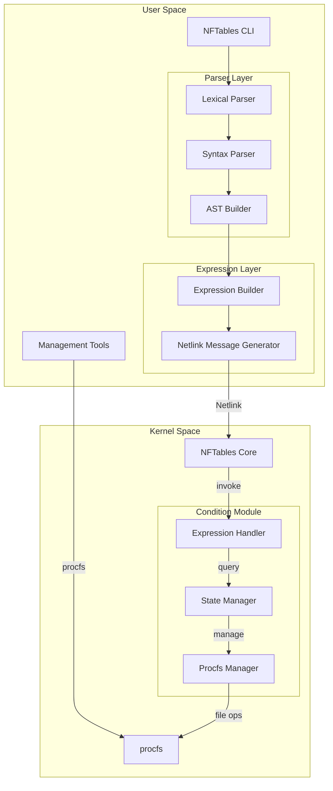
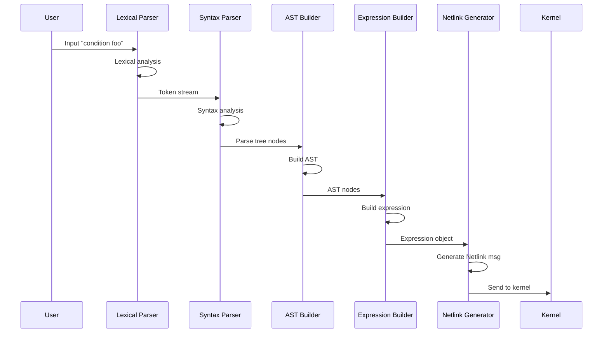
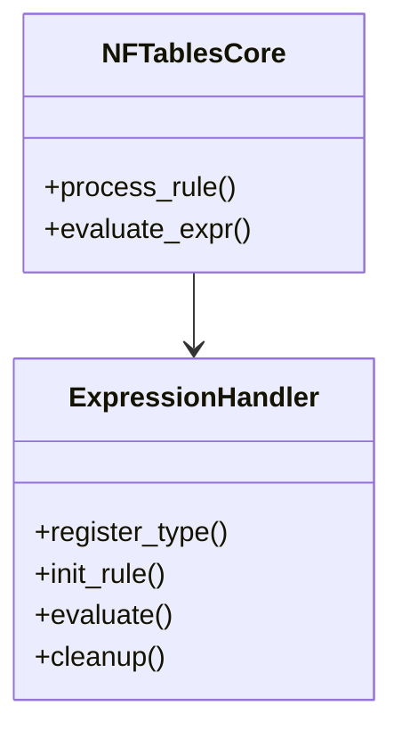
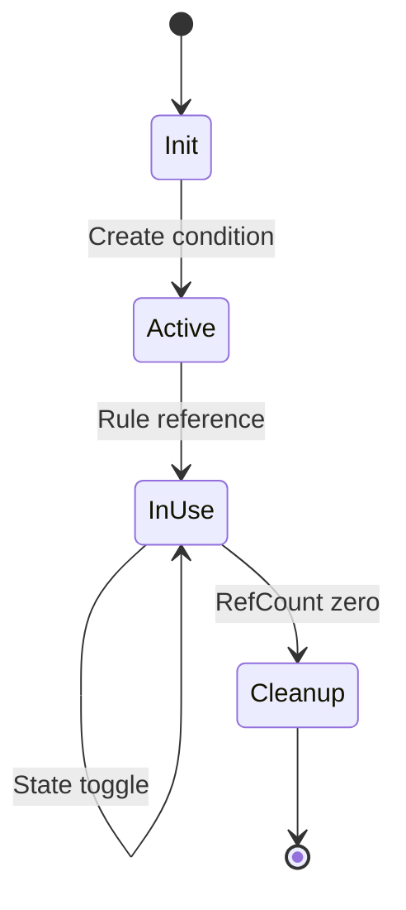
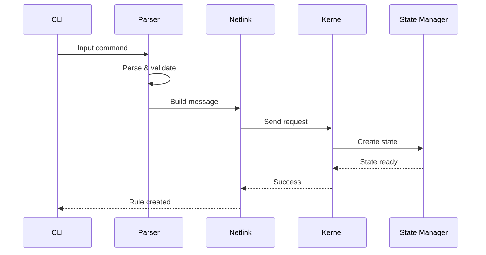
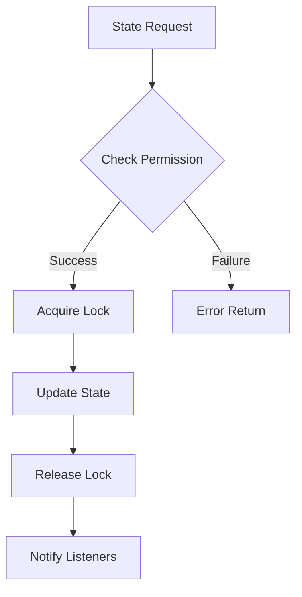
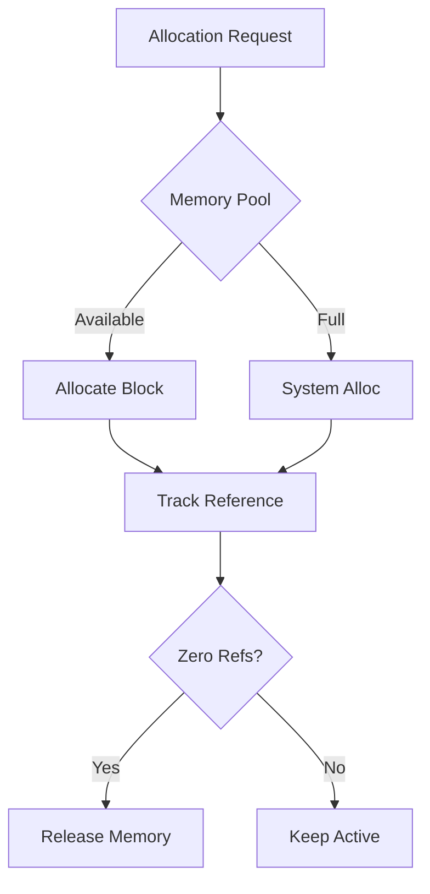
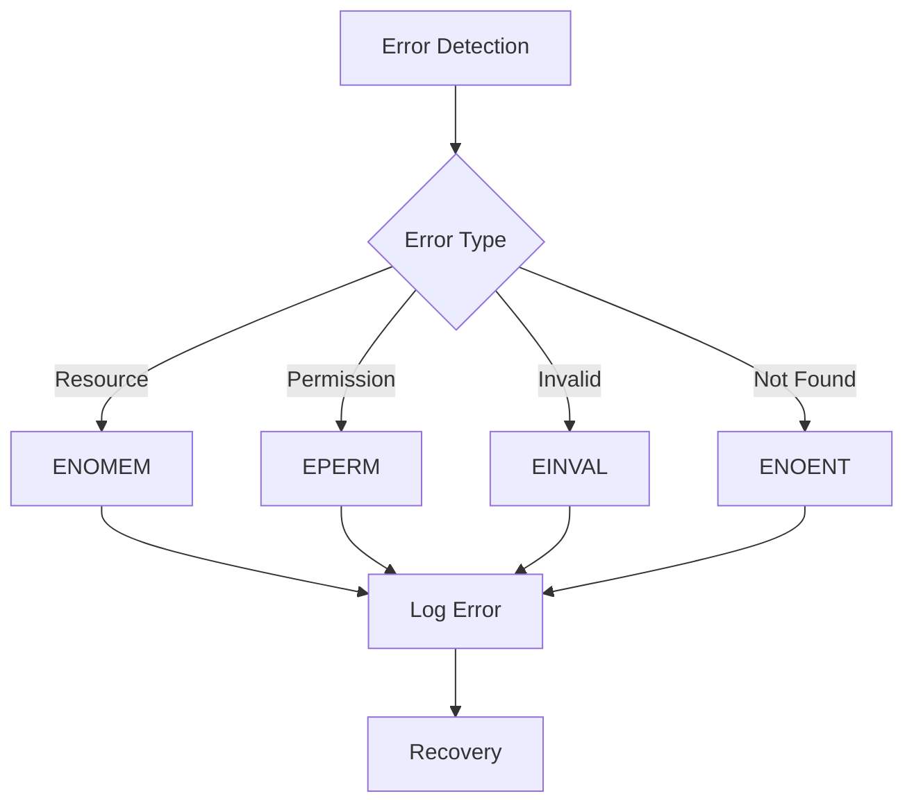
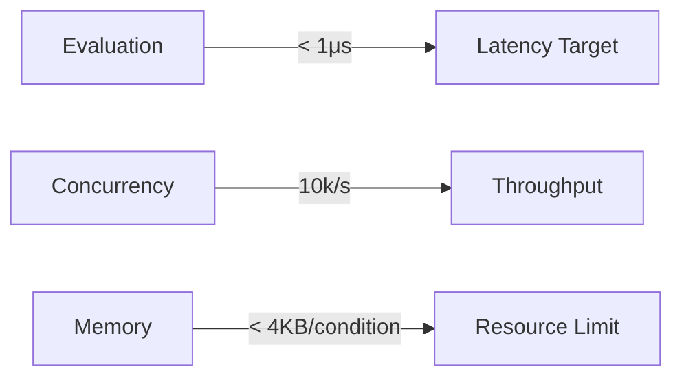

# NFTables Condition Module Architecture

## 1. System Architecture Overview

### 1.1 Overall Architecture


### 1.2 User Space Processing Flow


## 2. Core Components Design

### 2.1 User Space Components

#### 2.1.1 Parser Components
1. Lexical Parser
   ```c
   // Token types
   enum token_type {
       TOKEN_CONDITION,
       TOKEN_STRING,
       TOKEN_IDENTIFIER,
       // ...
   };

   struct token {
       enum token_type type;
       char *value;
       size_t line;
       size_t column;
   };
   ```

2. Syntax Parser
   ```c
   // AST node types
   enum node_type {
       NODE_CONDITION,
       NODE_EXPRESSION,
       NODE_IDENTIFIER,
       // ...
   };

   struct ast_node {
       enum node_type type;
       struct ast_node *left;
       struct ast_node *right;
       void *data;
   };
   ```

3. Expression Builder
   ```c
   struct nft_expr_info {
       const char *type;
       void *data;
       unsigned int size;
   };

   struct nft_condition_expr {
       char name[NFT_NAME_MAX];
       uint32_t flags;
   };
   ```

### 2.2 Kernel Space Components

#### 2.2.1 Expression Handler


#### 2.2.2 State Manager


## 3. Key Workflows

### 3.1 Rule Creation Flow


### 3.2 State Management


## 4. Resource Management

### 4.1 Memory Management Strategy


### 4.2 Lock Hierarchy
1. Global State Lock
   - Protects condition list
   - Coarse-grained synchronization

2. Per-Condition Lock
   - Protects individual state
   - Fine-grained operations

3. Atomic Operations
   - State toggles
   - Reference counting

## 5. Error Handling

### 5.1 Error Flow


### 5.2 Recovery Strategy
1. Transaction Rollback
   - Revert partial changes
   - Clean up resources
   - Maintain consistency

2. Error Propagation
   - Clear error codes
   - Detailed logging
   - User feedback

## 6. Performance Considerations

### 6.1 Critical Paths
1. Rule Evaluation
   - Optimize state lookup
   - Minimize lock contention
   - Cache hot conditions

2. State Updates
   - Batch processing
   - Efficient synchronization
   - Minimize copying

### 6.2 Performance Metrics


## 7. Security Design

### 7.1 Access Control
1. Rule Creation
   - Root only
   - Validation checks
   - Resource limits

2. State Modification
   - Configurable permissions
   - Audit logging
   - Rate limiting

### 7.2 Resource Protection
1. Input Validation
   - Size limits
   - Format checks
   - Sanitization

2. Resource Limits
   - Memory caps
   - File descriptor limits
   - CPU usage bounds

This architecture document provides a comprehensive view of both user space and kernel space components, their interactions, and key design decisions for the NFTables condition module. It serves as the foundation for detailed specification development and implementation planning.